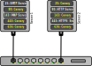

# Simple network canary examples

A network canary is a software that detects signs of a network breach. In the same way as canary birds used in the coal mines during the nineteenth century would allow the miners to flee dangerous gas, the goal of this canary software is to detect ongoing intrusions to limit their impact and attempt to protect critical data while it is still time.

### Principle

When an intruder manages to enter a private network, he has to search the network for computers with any kind of entry point that would allow him to strengthen his grip, and to gain access to valuable data. These entry points are the various network services opened by each machine, which potentially conceal exploitable vulnerabilities.

By adding bogus services to various machines on the network, or adding machines that look like servers but are not really servers, the intruder face the risk of connecting to a service that no legitimate user would have ever used. And that's where the canary awaits him.

### Content of this repository

The first version is a stand-alone program that simply sounds a loud alarm in case of intrusion. Simple and efficient.

The second version, the canary soldier, reports intrusions to a central hub for more sophisticated processing, such as transmitting alarms over a GSM link.

### Need more explanations ?

For more details, read the full blog post on [www.yoctopuce.com](https://www.yoctopuce.com/EN/article/a-canary-to-detect-network-intruders)